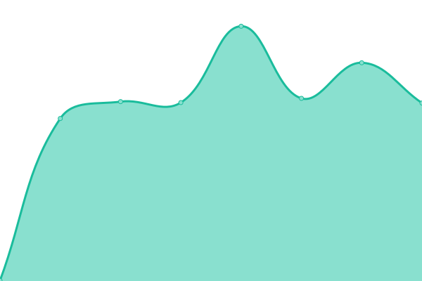

# [📈 Live Status](https://uptime.kvcb.me): <!--live status--> **🟧 Partial outage**

With [Upptime](https://upptime.js.org), you can get your own unlimited and free uptime monitor and status page, powered entirely by a GitHub repository. We use [Issues](https://github.com/upptime/upptime/issues) as incident reports, [Actions](https://github.com/intSailers/uptime/actions) as uptime monitors, and [Pages](https://demo.upptime.js.org) for the status page.

<!--start: status pages-->
<!-- This summary is generated by Upptime (https://github.com/upptime/upptime) -->
<!-- Do not edit this manually, your changes will be overwritten -->
<!-- prettier-ignore -->
| URL | Status | History | Response Time | Uptime |
| --- | ------ | ------- | ------------- | ------ |
|  日本｜Oracle | 🟥 Down | [oracle.yml](https://github.com/intSailers/uptime/commits/HEAD/history/oracle.yml) | 

 0ms
     
 | 

<a href="https://uptime.kvcb.me/history/oracle">100.00%</a>
    

|  洛杉矶｜CN2GIA | 🟩 Up | [cn-2-gia.yml](https://github.com/intSailers/uptime/commits/HEAD/history/cn-2-gia.yml) | 

 268ms
     
 | 

<a href="https://uptime.kvcb.me/history/cn-2-gia">100.00%</a>
    

|  台湾｜HINET｜直连 | 🟥 Down | [hinet.yml](https://github.com/intSailers/uptime/commits/HEAD/history/hinet.yml) | 

 0ms
     
 | 

<a href="https://uptime.kvcb.me/history/hinet">0.00%</a>
    

<!--end: status pages-->

## 📄 License

- Powered by: [Upptime](https://github.com/upptime/upptime)
- Code: [MIT](./LICENSE) © [Upptime](https://upptime.js.org)
- Data in the `./history` directory: [Open Database License](https://opendatacommons.org/licenses/odbl/1-0/)
